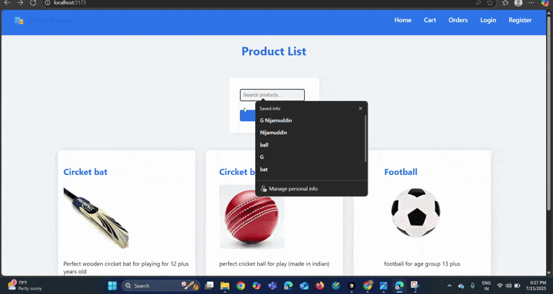

# ShopEase

[](https://www.youtube.com/watch?v=YOUR_VIDEO_LINK)

---

## Technologies Used

- **Backend:** Node.js, Express.js, MongoDB, Mongoose
- **Authentication:** JWT, bcryptjs
- **File Uploads:** multer
- **Environment Variables:** dotenv
- **Frontend:** React, Axios, React Router, Context API
- **Styling:** CSS (Flipkart-inspired theme)

---

## Features & Functionalities

- **User Authentication:**
  - JWT-based authentication
  - Admin and customer roles
- **Product Management:**
  - Admin CRUD (Create, Read, Update, Delete) for products
  - Image upload for products (multer, static serving)
- **Cart Management:**
  - Add, update, and remove products from cart
- **Order Management:**
  - Create orders from cart
  - View order history
- **Product Listing:**
  - Pagination and search functionality
  - Grid layout with consistent product card sizing
- **Frontend:**
  - Modern, e-commerce-relevant UI (Flipkart-inspired)
  - Responsive design
  - Product images (static and uploaded)
  - Cart and order pages styled for clarity
- **RESTful API:**
  - Follows REST best practices

---

## Setup & Usage

1. Clone the repository:
   ```sh
   git clone https://github.com/Nijamuddingmd/ShopEase.git
   ```
2. Install dependencies for backend and frontend:
   ```sh
   npm install
   cd shop-frontend && npm install
   ```
3. Create a `.env` file in the root (see `.env.example` for required variables).
4. Start the backend and frontend servers.
5. Access the app in your browser.

---

## Notes
- Do **not** commit real images or sensitive data.
- The `uploads/` folder is for product images and should contain a `.gitkeep` file.
- See the assignment for full requirements.
